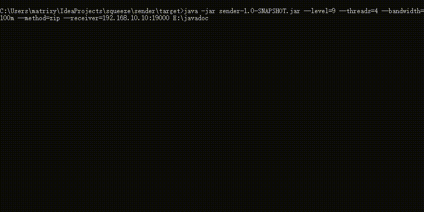

## squeeze 文件压缩传输
客户端遍历文件，将数据压缩传输到服务器端，服务器一边接收一边解压。可用于大文件传输，日志文件的转移，通过在线压缩传输的方法，以达到时间换空间的目的。

### sender客户端
#### 参数
1. `--level=` 压缩级别，0-9
2. `--threads=` 压缩线程数
3. `--bandwidth=` 带宽限制，单位可以是k、m、g
4. `--method=` 压缩方式，如zip或7zip（目前只支持zip）
5. `--receiver=` 接收方，格式如：IP/域名:端口
6. 文件或目录名，可以是一个或多个文件、目录，目录将遍历其下全部的文件及路径

> 注意，带宽限制表示的是传输速率的上限，通常会受接收方的处理速度及带宽等影响，而通常会导致无法达到设定的上限。

### receiver接收服务器端
1. 配置项见配置文件`/src/main/resources/conf.properties`
2. 服务器端支持单会话连接，多会话连接可能会导致IO、CPU负载过高，影响到其它应用。
